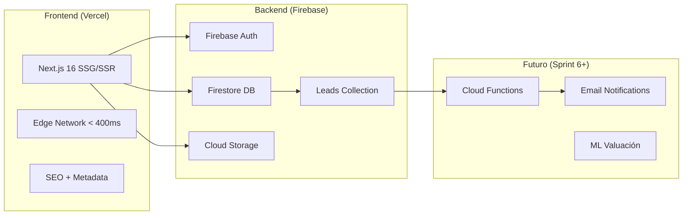
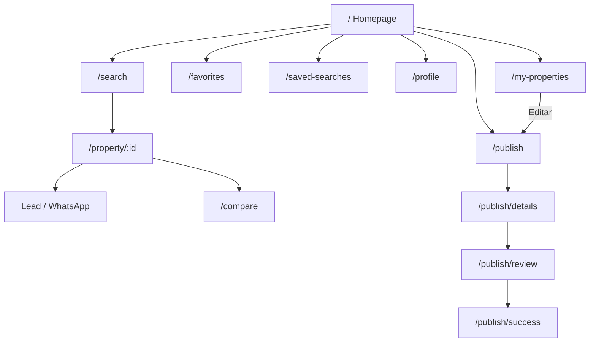
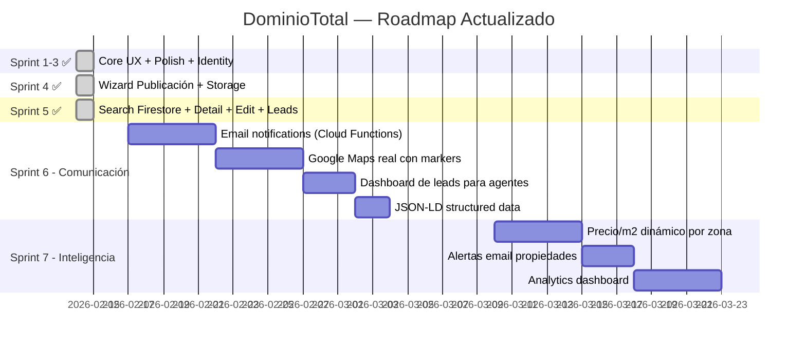

# PRD Final — DominioTotal v3.0
### Plataforma Inmobiliaria Premium para Uruguay
**Versión:** 3.0.0 · **Fecha:** 14 Feb 2026 · **Benchmark:** Funda.nl · **Estado:** Sprint 5 ✅ Completado

---

## 1. Visión del Producto

**DominioTotal** es la primera plataforma inmobiliaria de Uruguay diseñada con estándares de producto digital de clase mundial. No es un clasificado — es una experiencia de búsqueda y publicación que combina datos inteligentes del mercado uruguayo con una interfaz mobile-first al nivel de Funda.nl (Holanda).

**Diferenciador clave:** Datos de mercado integrados (Vivienda Promovida Ley 18.795, garantías, precio/m², rendimiento estimado) + experiencia mobile-first + publicación directa por propietarios.

> [!IMPORTANT]
> **Lead target:** Inquilino/comprador en Montevideo, rango $35.000 UYU / USD 150-350K. Perfil que mueve el 70% del mercado inmobiliario uruguayo.

---

## 2. Posición Competitiva

### 2.1 Competidores en Uruguay

| Plataforma | Fortaleza | Debilidad |
|---|---|---|
| **InfoCasas** | Market-share líder, ~60K anuncios | UI legacy, carga lenta, UX desktop-centric |
| **MercadoLibre Inmuebles** | Tráfico inmenso (marketplace) | Sin filtros Uruguay-específicos, no premium |
| **Gallito.com** | Tradición en clasificados UY | Diseño obsoleto, sin funciones modernas |
| **Properati** | Buen diseño, mapa integrado | Menor penetración en UY, sin datos Ley 18.795 |

### 2.2 Ventajas de DominioTotal

| Ventaja | vs InfoCasas | vs ML Inmuebles | vs Gallito |
|---|---|---|---|
| Mobile-first con bottom tab | ❌ No tienen | ❌ No tienen | ❌ No tienen |
| Dark mode completo | ❌ | ❌ | ❌ |
| Datos Ley 18.795 (Vivienda Promovida) | ❌ | ❌ | ❌ |
| Garantías visibles (ANDA, CGN, Porto) | ⚠️ Parcial | ❌ | ❌ |
| Publicación sin intermediarios (4 pasos) | ✅ Tienen | ✅ Tienen | ⚠️ Básico |
| Cloud sync favoritos (local → Firebase) | ❌ | ❌ | ❌ |
| Edición de propiedades en wizard | ⚠️ Básico | ⚠️ Básico | ❌ |
| Lead capture a Firestore | ✅ Tienen | ✅ Tienen | ⚠️ Email |
| Mapa interactivo por barrio | ✅ Tienen | ⚠️ Básico | ❌ |
| Stack moderno (Next.js 16 + React 19) | ❌ Legacy | ❌ PHP/monolith | ❌ Legacy |

> [!TIP]
> **Estrategia ganadora:** DominioTotal ataca el "gap" entre el tráfico de ML/InfoCasas y la experiencia premium que no ofrecen. El usuario que busca apartamento en Pocitos necesita Vivienda Promovida, garantías y precio/m² — nadie lo muestra hoy.

---

## 3. Arquitectura Técnica



| Capa | Tecnología | Estado |
|---|---|---|
| **Frontend** | Vercel + Next.js 16.1.6 + React 19 | ✅ Producción |
| **Estilos** | Tailwind CSS 4 + shadcn/ui | ✅ Producción |
| **Animaciones** | Framer Motion 12.34 | ✅ Producción |
| **Auth** | Firebase Auth (Google) | ✅ Producción |
| **Base de datos** | Firestore | ✅ Producción |
| **Storage** | Firebase Cloud Storage | ✅ Producción |
| **Leads** | Firestore `leads` collection | ✅ Producción |
| **Búsqueda** | Firestore Queries + Faceted UI | ✅ Producción |
| **Email** | Cloud Functions + SendGrid | 🔶 Sprint 6 |
| **Inteligencia** | ML Valuación + Analytics | 🔴 Sprint 7 |

---

## 4. Usuarios Objetivo

| Persona | Descripción | Lead Target | Flujo |
|---|---|---|---|
| **Comprador/Inversor** | Busca vivienda o inversión (Ley 18.795) | USD 150K-350K | `/` → `/search` → `/property/:id` → Lead |
| **Inquilino** | Busca alquilar, necesita garantía | ~$35K UYU/mes | `/` → `/search` → `/property/:id` → WhatsApp |
| **Propietario** | Publica sin intermediarios | — | `/publish` → 4 pasos → Dashboard |
| **Agente** | Gestiona cartera profesional | — | `/publish` + `/my-properties` |

---

## 5. Mapa de Rutas (14 rutas activas)



| Ruta | Tipo | Estado | Features |
|---|---|---|---|
| `/` | Static | ✅ | Hero, Dropdowns, Cards destacadas, Favoritos |
| `/search` | Dynamic | ✅ | Filtros facetados, Firestore queries, Mapa, Guardar búsqueda |
| `/property/[id]` | Dynamic | ✅ | Galería, Stats, CTA sticky, Lead form, NeighborhoodMap |
| `/compare` | Static | ✅ | Tabla 3 propiedades side-by-side |
| `/publish` | Dynamic | ✅ | Step 1: Tipo, Operación, Ubicación |
| `/publish/details` | Dynamic | ✅ | Step 2: Fotos (Cloud Storage), Precio, Detalles |
| `/publish/review` | Dynamic | ✅ | Step 3: Resumen, Publicar/Guardar cambios |
| `/publish/success` | Static | ✅ | Confirmación + Navegación |
| `/favorites` | Dynamic | ✅ | Grid favoritos (Cloud + Local Sync) |
| `/saved-searches` | Dynamic | ✅ | Búsquedas guardadas (Cloud + Local Sync) |
| `/profile` | Dynamic | ✅ | Dashboard usuario, Avatar, Gestión cuenta |
| `/my-properties` | Dynamic | ✅ | Anuncios propios: Ver, Editar, Eliminar |
| `/properties/[id]` | Dynamic | ✅ | Ruta alternativa de detalle |

---

## 6. Componentes Implementados (31 total)

### Custom (12)

| Componente | Archivo | Estado |
|---|---|---|
| [Navbar](file:///D:/INMOBILIARIA/components/layout/Navbar.tsx#9-152) | [components/layout/Navbar.tsx](file:///D:/INMOBILIARIA/components/layout/Navbar.tsx) | ✅ Auth dinámica |
| `Footer` | [components/layout/Footer.tsx](file:///D:/INMOBILIARIA/components/layout/Footer.tsx) | ✅ |
| [BottomTabBar](file:///D:/INMOBILIARIA/components/layout/BottomTabBar.tsx#14-59) | [components/layout/BottomTabBar.tsx](file:///D:/INMOBILIARIA/components/layout/BottomTabBar.tsx) | ✅ Mobile nav |
| [CompareBar](file:///D:/INMOBILIARIA/components/CompareBar.tsx#9-58) | [components/CompareBar.tsx](file:///D:/INMOBILIARIA/components/CompareBar.tsx) | ✅ |
| [FavoriteButton](file:///D:/INMOBILIARIA/components/FavoriteButton.tsx#10-33) | [components/FavoriteButton.tsx](file:///D:/INMOBILIARIA/components/FavoriteButton.tsx) | ✅ Con feedback visual |
| [PropertyCard](file:///D:/INMOBILIARIA/components/Skeletons.tsx#3-29) | [components/PropertyCard.tsx](file:///D:/INMOBILIARIA/components/PropertyCard.tsx) | ✅ next/image optimizado |
| `Skeletons` | [components/Skeletons.tsx](file:///D:/INMOBILIARIA/components/Skeletons.tsx) | ✅ Shimmer effects |
| [FloorplanViewer](file:///D:/INMOBILIARIA/components/FloorplanViewer.tsx#12-53) | [components/FloorplanViewer.tsx](file:///D:/INMOBILIARIA/components/FloorplanViewer.tsx) | ✅ Planos interactivos |
| `NeighborhoodMap` | [components/NeighborhoodMap.tsx](file:///D:/INMOBILIARIA/components/NeighborhoodMap.tsx) | ✅ Mapa barrio |
| [SmartSearch](file:///D:/INMOBILIARIA/components/SmartSearch.tsx#29-145) | [components/SmartSearch.tsx](file:///D:/INMOBILIARIA/components/SmartSearch.tsx) | ✅ Autocomplete |
| [AuthModal](file:///D:/INMOBILIARIA/components/auth/AuthModal.tsx#12-113) | [components/auth/AuthModal.tsx](file:///D:/INMOBILIARIA/components/auth/AuthModal.tsx) | ✅ Glassmorphism |
| [ImageUploader](file:///D:/INMOBILIARIA/components/publish/ImageUploader.tsx#13-124) | [components/publish/ImageUploader.tsx](file:///D:/INMOBILIARIA/components/publish/ImageUploader.tsx) | ✅ Cloud Storage |

### shadcn/ui (11)
`avatar`, `badge`, `button`, `card`, `checkbox`, `dialog`, `dropdown-menu`, `input`, `label`, `select`, `separator`, `sheet`, `slider`, `textarea`, `tooltip`

### Contexts (4)

| Context | Archivo | Sync | Estado |
|---|---|---|---|
| [AuthContext](file:///D:/INMOBILIARIA/contexts/AuthContext.tsx#13-19) | [contexts/AuthContext.tsx](file:///D:/INMOBILIARIA/contexts/AuthContext.tsx) | Firebase Auth | ✅ |
| [FavoritesContext](file:///D:/INMOBILIARIA/contexts/FavoritesContext.tsx#8-14) | [contexts/FavoritesContext.tsx](file:///D:/INMOBILIARIA/contexts/FavoritesContext.tsx) | localStorage ↔ Firestore | ✅ |
| [SavedSearchesContext](file:///D:/INMOBILIARIA/contexts/SavedSearchesContext.tsx#25-31) | [contexts/SavedSearchesContext.tsx](file:///D:/INMOBILIARIA/contexts/SavedSearchesContext.tsx) | localStorage ↔ Firestore | ✅ |
| [PublishContext](file:///D:/INMOBILIARIA/contexts/PublishContext.tsx#53-61) | [contexts/PublishContext.tsx](file:///D:/INMOBILIARIA/contexts/PublishContext.tsx) | sessionStorage + Firestore edit | ✅ |

---

## 7. Schema de Datos — Firestore

> [!IMPORTANT]
> El schema en [data.ts](file:///D:/INMOBILIARIA/lib/data.ts) está 1:1 con las colecciones de Firestore. Todas las propiedades se guardan y leen dinámicamente.

### Colección `properties`

| Campo | Tipo | Ejemplo |
|---|---|---|
| [id](file:///D:/INMOBILIARIA/contexts/AuthContext.tsx#29-72) | `string` | Auto-generated |
| `title` | `string` | `"Penthouse en Pocitos Nuevo"` |
| `type` | [PropertyType](file:///D:/INMOBILIARIA/lib/data.ts#14-22) | `"Apartamento"` |
| `operation` | [OperationType](file:///D:/INMOBILIARIA/lib/data.ts#11-12) | `"Venta"` / `"Alquiler"` |
| `price` / `currency` | `number` / `string` | `245000` / `"USD"` |
| `bedrooms` / `bathrooms` / `area` | `number` | `2 / 2 / 85` |
| `department` / `city` / `neighborhood` | `string` | `"Montevideo"` / `"Pocitos"` |
| `images` | `string[]` | Cloud Storage URLs |
| `amenities` | `string[]` | `["Piscina", "Gimnasio"]` |
| `viviendaPromovida` | `boolean` | Ley 18.795 |
| `acceptedGuarantees` | `GuaranteeType[]` | `["ANDA", "CGN"]` |
| `userId` | `string` | Firebase UID del publicador |
| `status` | `"active" \| "pending"` | Estado de moderación |
| `publishedAt` / `updatedAt` | `Timestamp` | Firestore timestamps |

### Colección `leads`

| Campo | Tipo | Propósito |
|---|---|---|
| `propertyId` | `string` | Referencia a la propiedad |
| `propertyTitle` | `string` | Título para notificaciones |
| `agentId` | `string` | UID del propietario/agente |
| `leadName` / `leadEmail` | `string` | Datos del interesado |
| `leadMessage` | `string` | Mensaje de consulta |
| `status` | `"new"` | Estado del lead |
| `createdAt` | `Timestamp` | Fecha de la consulta |

### Colección `users` (documento por UID)

| Campo | Tipo | Propósito |
|---|---|---|
| `favorites` | `string[]` | IDs de propiedades favoritas |
| `savedSearches` | `SavedSearch[]` | Búsquedas guardadas |

---

## 8. Flujos Implementados

### 8.1 Flujo de Búsqueda (Completo)
```
Homepage → Seleccionar filtros → /search?operation=Venta&type=Casa
→ Firestore query dinámica → PropertyCard grid → Click → /property/[id]
→ Fetch por ID → Galería + Stats + Amenities + Lead form
```

### 8.2 Flujo de Publicación (Completo)
```
/publish → Step 1 (Tipo, Operación, Ubicación)
→ /publish/details → Step 2 (Fotos a Cloud Storage, Precio, Detalles)
→ /publish/review → Step 3 (Resumen + addDoc a Firestore)
→ /publish/success → Confirmación
```

### 8.3 Flujo de Edición (Completo)
```
/my-properties → Click "Editar" → /publish?edit=[id]
→ startEditing(id) → Fetch de Firestore → Pre-poblar wizard
→ Navegar pasos → /publish/review → updateDoc → /publish/success
```

### 8.4 Flujo de Lead Capture (Completo)
```
/property/[id] → Formulario contacto (Desktop sidebar o Mobile sheet)
→ Nombre + Email + Mensaje → addDoc("leads") → Feedback visual ✅
```

### 8.5 Flujo de Favoritos (Completo)
```
❤️ Click en cualquier PropertyCard → toggleFavorite(id)
→ Guest: localStorage | User: Firestore real-time sync
→ /favorites → Grid con IDs guardados
```

---

## 9. Gap Analysis Actualizado: DominioTotal vs Funda.nl

### ✅ Match con Funda

| Feature | Estado |
|---|---|
| Mobile-first responsive | ✅ |
| Bottom tab navigation | ✅ |
| Swipe gallery mobile | ✅ |
| Sticky CTA bar mobile | ✅ |
| Filtros avanzados + facetados | ✅ |
| Dark mode | ✅ |
| WhatsApp como canal CTA | ✅ |
| Búsqueda dinámica con Firestore | ✅ |
| Detalle dinámico por ID | ✅ |
| Publicación completa (4 pasos) | ✅ |
| Edición de propiedades | ✅ |
| Cloud sync favoritos | ✅ |
| Lead capture funcional | ✅ |
| Loading skeletons | ✅ |
| Etiqueta energética visual | ✅ |
| Mapa de barrio interactivo | ✅ |

### 🔶 Pendiente (Sprint 6-7)

| Feature | Sprint | Prioridad |
|---|---|---|
| Notificaciones email de leads | 6 | 🔴 Alta |
| Google Maps real con markers | 6 | 🔴 Alta |
| Dashboard de leads para agentes | 6 | 🟡 Media |
| Búsqueda por radio/polígono en mapa | 6 | 🟡 Media |
| Precio/m² dinámico por zona | 7 | 🟡 Media |
| Alertas push/email nuevas propiedades | 7 | 🟡 Media |
| Valuación ML | 7 | 🟢 Baja |
| JSON-LD structured data | 6 | 🟡 Media |
| Analytics / Métricas de conversión | 7 | 🟡 Media |

---

## 10. Roadmap de Sprints



### Sprint 1-3 ✅ COMPLETADOS
- [x] Favoritos + Búsquedas guardadas (Cloud Sync)
- [x] UI Polish: Bottom Tab, next/image, Dark mode, Skeletons
- [x] Firebase Auth + Firestore Sync
- [x] Perfil de usuario + Dashboard
- [x] SEO audit (metadata, sitemap, robots)

### Sprint 4 ✅ COMPLETADO
- [x] Wizard de publicación (4 pasos con [PublishContext](file:///D:/INMOBILIARIA/contexts/PublishContext.tsx#53-61))
- [x] [ImageUploader](file:///D:/INMOBILIARIA/components/publish/ImageUploader.tsx#13-124) con Firebase Cloud Storage
- [x] Dashboard "Mis Propiedades" (Ver/Eliminar)
- [x] Página de éxito post-publicación

### Sprint 5 ✅ COMPLETADO
- [x] Búsqueda conectada a Firestore (filtros dinámicos)
- [x] Detalle de propiedad dinámico (fetch por ID)
- [x] Flujo de edición completo (pre-poblar wizard + `updateDoc`)
- [x] Leads API (formulario → colección `leads` en Firestore)

### Sprint 6 — Comunicación (PRÓXIMO)
- [ ] Cloud Functions para email de leads al agente
- [ ] Google Maps real con markers de propiedades
- [ ] Dashboard de leads recibidos en `/my-properties`
- [ ] JSON-LD structured data para SEO avanzado

### Sprint 7 — Inteligencia
- [ ] Precio/m² dinámico calculado por zona
- [ ] Alertas email cuando se publican propiedades matching
- [ ] Analytics dashboard (vistas, leads, conversiones)

---

## 11. Plan de Testing (QA Checklist)

> [!CAUTION]
> Cada punto debe ser verificado manualmente antes de considerar un sprint como "listo para producción".

### 11.1 🏠 Homepage (`/`)

| # | Test Case | Criterio de Éxito |
|---|---|---|
| H-01 | Hero render completo | Imagen de fondo, título, subtítulo visibles |
| H-02 | Dropdowns de Tipo/Operación | Seleccionan valores y redirigen a `/search` con params |
| H-03 | SmartSearch autocomplete | Al escribir 4+ caracteres, aparecen sugerencias |
| H-04 | Cards de propiedades destacadas | Muestran imagen, precio, ubicación, badge |
| H-05 | FavoriteButton en cada card | Click togglea ❤️, se persiste en localStorage/Firestore |
| H-06 | Responsive mobile | Layout stacked, bottom tab visible, no overflow |
| H-07 | Dark mode toggle | Colores cambian coherentemente |

### 11.2 🔍 Búsqueda (`/search`)

| # | Test Case | Criterio de Éxito |
|---|---|---|
| S-01 | Carga desde Firestore | Las propiedades aparecen al cargar (no mock data) |
| S-02 | Filtro por operación | Al seleccionar "Alquiler", solo se muestran alquileres |
| S-03 | Filtro por tipo de propiedad | Al seleccionar "Casa", solo casas aparecen |
| S-04 | Filtro por departamento/ciudad/barrio | Geo cascade funciona correctamente |
| S-05 | Filtro por rango de precio | Slider filtra propiedades en el rango |
| S-06 | Filtro por dormitorios | Selector de dormitorios filtra correctamente |
| S-07 | Limpiar filtros | "Limpiar" resetea todos los filtros y recarga |
| S-08 | Skeleton loading | Skeletons se muestran mientras se cargan propiedades |
| S-09 | Empty state | Si no hay resultados, se muestra mensaje amigable |
| S-10 | Guardar búsqueda | Click "Guardar" crea una SavedSearch en contexto |
| S-11 | URL sync | Los filtros activos se reflejan en la URL |
| S-12 | Click en PropertyCard | Navega a `/property/[id]` correctamente |
| S-13 | Responsive mobile | Filtros en sheet mobile, grid 1 columna |

### 11.3 📄 Detalle de Propiedad (`/property/[id]`)

| # | Test Case | Criterio de Éxito |
|---|---|---|
| D-01 | Fetch por ID | Datos reales de Firestore se muestran |
| D-02 | Galería de fotos | Carrusel funcional, navegación con flechas |
| D-03 | Precio formateado | `USD 245.000` o `UYU 35.000/mes` correctamente |
| D-04 | Features grid | m², dormitorios, baños, garaje con datos reales |
| D-05 | Descripción | Texto completo del anuncio |
| D-06 | Amenities | Lista de amenidades con checkmarks |
| D-07 | Mapa de barrio | `NeighborhoodMap` renderiza con coordenadas |
| D-08 | Plano (si existe) | [FloorplanViewer](file:///D:/INMOBILIARIA/components/FloorplanViewer.tsx#12-53) se muestra si hay `floorplanUrl` |
| D-09 | Badge Vivienda Promovida | Visible si `viviendaPromovida: true` |
| D-10 | Formulario de contacto (desktop) | Nombre, Email, Mensaje → submit → lead en Firestore |
| D-11 | Feedback de lead enviado | Mensaje "¡Consulta Enviada!" con check verde |
| D-12 | Contact sheet mobile | Botón "Contactar" abre formulario en sheet |
| D-13 | WhatsApp button | Botón WhatsApp visible y funcional |
| D-14 | Sticky CTA bar mobile | Barra fija con precio + botones en mobile |
| D-15 | Loading state | Spinner mientras se carga la propiedad |
| D-16 | Propiedad no encontrada | Mensaje 404 amigable si el ID no existe |

### 11.4 📝 Publicación (`/publish` → `/review` → `/success`)

| # | Test Case | Criterio de Éxito |
|---|---|---|
| P-01 | Step 1: Tipo y Operación | Selección de radio buttons funciona |
| P-02 | Step 1: Ubicación | Departamento → Ciudad → Barrio cascade |
| P-03 | Step 2: Subir imágenes | [ImageUploader](file:///D:/INMOBILIARIA/components/publish/ImageUploader.tsx#13-124) sube a Cloud Storage y muestra preview |
| P-04 | Step 2: Precio y detalles | Inputs numéricos, currency toggle, description |
| P-05 | Step 2: Vivienda Promovida | Checkbox togglea correctamente |
| P-06 | Step 2: Garantías | Checkboxes múltiples (ANDA, CGN, etc.) |
| P-07 | Step 3: Amenities | Selección múltiple funcional |
| P-08 | Review: Resumen completo | Todos los datos se muestran correctamente |
| P-09 | Review: Publicar | `addDoc` guarda en Firestore con timestamps |
| P-10 | Success page | Se muestra confirmación con links |
| P-11 | sessionStorage persistente | Al recargar, los datos del wizard se mantienen |
| P-12 | Requiere auth | Sin login, redirige o muestra modal de auth |

### 11.5 ✏️ Edición (`/my-properties` → `/publish?edit=[id]`)

| # | Test Case | Criterio de Éxito |
|---|---|---|
| E-01 | Dashboard carga propiedades | Solo muestra propiedades del usuario logueado |
| E-02 | Botón "Editar" | Navega a `/publish?edit=[id]` |
| E-03 | Pre-poblar wizard | [startEditing(id)](file:///D:/INMOBILIARIA/contexts/PublishContext.tsx#96-128) carga datos en todos los steps |
| E-04 | Modificar precio | Cambiar precio y verificar en review |
| E-05 | Guardar cambios | `updateDoc` actualiza Firestore con `updatedAt` |
| E-06 | Botón dice "GUARDAR CAMBIOS" | UI refleja modo edición (no "Publicar") |
| E-07 | Botón "Eliminar" | Elimina propiedad de Firestore y actualiza lista |

### 11.6 ❤️ Favoritos y Búsquedas Guardadas

| # | Test Case | Criterio de Éxito |
|---|---|---|
| F-01 | Toggle favorito (guest) | Persiste en localStorage |
| F-02 | Toggle favorito (autenticado) | Persiste en Firestore real-time |
| F-03 | Merge al login | Favoritos locales se fusionan con cloud |
| F-04 | `/favorites` grid | Muestra cards de propiedades favoritas |
| F-05 | Empty state favoritos | Mensaje amigable si no hay favoritos |
| F-06 | Guardar búsqueda (guest) | Persiste en localStorage |
| F-07 | Guardar búsqueda (autenticado) | Persiste en Firestore |
| F-08 | `/saved-searches` lista | Muestra búsquedas con filtros aplicados |
| F-09 | Eliminar búsqueda | Remove funcional |

### 11.7 👤 Auth y Perfil

| # | Test Case | Criterio de Éxito |
|---|---|---|
| A-01 | Login con Google | Modal glassmorphism → Firebase Auth → redirect |
| A-02 | Navbar actualizada | Avatar y nombre del usuario en navbar |
| A-03 | Logout | Limpia sesión, vuelve a guest mode |
| A-04 | Página `/profile` | Muestra info del usuario (avatar, email, nombre) |
| A-05 | Protected routes | `/publish`, `/my-properties` requieren auth |

### 11.8 📱 Mobile y Responsive

| # | Test Case | Criterio de Éxito |
|---|---|---|
| M-01 | Bottom tab bar | Visible solo en mobile, 4 tabs funcionales |
| M-02 | Homepage stacked | Layout vertical correcto en 375px |
| M-03 | Search filters sheet | Filtros abren en bottom sheet en mobile |
| M-04 | Property detail scroll | Galería + info en layout vertical fluido |
| M-05 | Contact form sheet | Se abre desde sticky bar, funcional |
| M-06 | Publish wizard mobile | Steps navegables sin overflow |
| M-07 | Dark mode mobile | Todos los componentes respetan dark mode |

### 11.9 🌐 SEO y Performance

| # | Test Case | Criterio de Éxito |
|---|---|---|
| X-01 | Title tags por página | Cada página tiene `<title>` único |
| X-02 | Meta descriptions | Cada página tiene meta description |
| X-03 | sitemap.xml | Accesible en `/sitemap.xml` |
| X-04 | robots.txt | Accesible en `/robots.txt` |
| X-05 | Build sin errores | `npm run build` completa sin warnings |
| X-06 | Lighthouse > 80 | Performance + Accessibility + SEO |
| X-07 | LCP < 3s | Largest Contentful Paint aceptable |
| X-08 | next/image | Todas las imágenes usan `<Image>` de Next.js |

---

## 12. Métricas de Éxito (KPIs)

| Métrica | Target | Herramienta |
|---|---|---|
| Lighthouse Performance | >85 | Chrome DevTools |
| LCP | <2.5s | Web Vitals |
| CLS | <0.1 | Web Vitals |
| Tasa de contacto (lead/vista) | >5% | Firestore Analytics |
| Publicaciones/mes | >50 en Q1 | Firestore count |
| Tiempo en sitio | >3 min | Analytics |
| Bounce rate | <40% | Analytics |
| Favoritos/usuario | >3 | Firestore |

---

## 13. Riesgos y Mitigaciones

| Riesgo | Impacto | Mitigación |
|---|---|---|
| Sin leads email → agentes no responden | 🔴 Alto | Sprint 6: Cloud Functions email |
| Composite indexes Firestore no creados | 🟡 Medio | Crear indexes a medida que Firebase lo pida |
| Performance con más propiedades (+1K) | 🟡 Medio | Paginación + Firestore limits |
| Competidores con más contenido | 🔴 Alto | Diferenciarse en UX + datos Uruguay |
| Bundle Firebase pesado | 🟡 Medio | Lazy imports + tree-shaking |
| Sin analytics = sin datos de conversión | 🟡 Medio | Sprint 7: Analytics |
| Maps estáticos no interactivos | 🟡 Medio | Sprint 6: Google Maps API |
